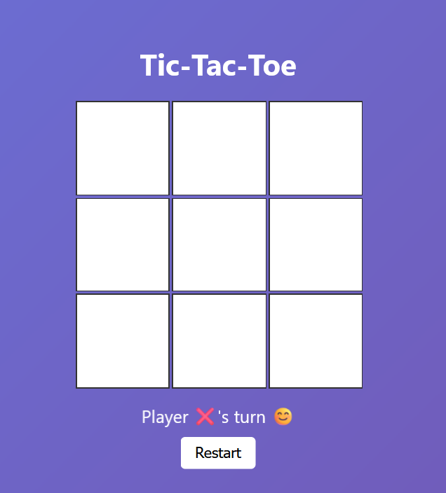
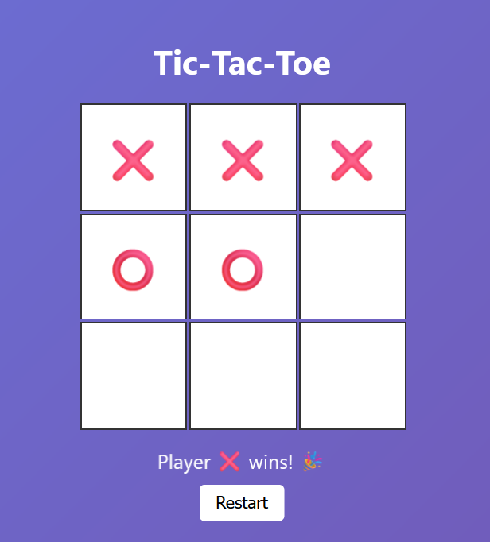
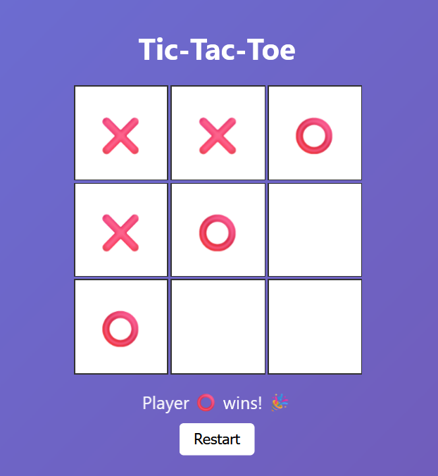
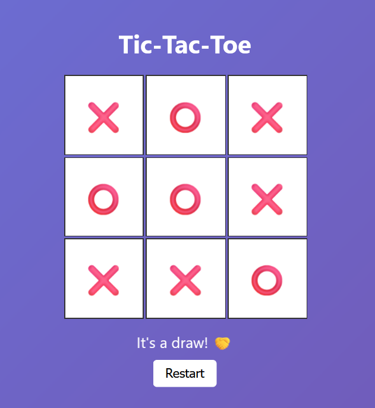

 🕹️ Tic-Tac-Toe Game

Tic-Tac-Toe is a classic two-player game played on a 3x3 grid. Players take turns marking a square with
their symbol (X or O) in an attempt to get three of their symbols in a row—horizontally, vertically, or
diagonally. The game ends when one player wins or if all squares are filled without a winner, resulting in a
draw. It’s a simple yet strategic game that can be played on paper or as a digital application.

🚀 Features

- 🎮 Interactive gameplay with emoji symbols
- 💡 Turn indicator and game status updates
- 🔁 Restart button to play again
- 🎨 Gradient background with clean modern UI

📸 Screenshots

🧩 Game Board UI

### ❌ Player X Wins

### ⭕ Player O Wins

### 🤝 Draw Scenario

🛠️ Technologies Used

* HTML5
* CSS3
* JavaScript (Vanilla)

📃 License
This project is licensed under the [MIT License](LICENSE).

